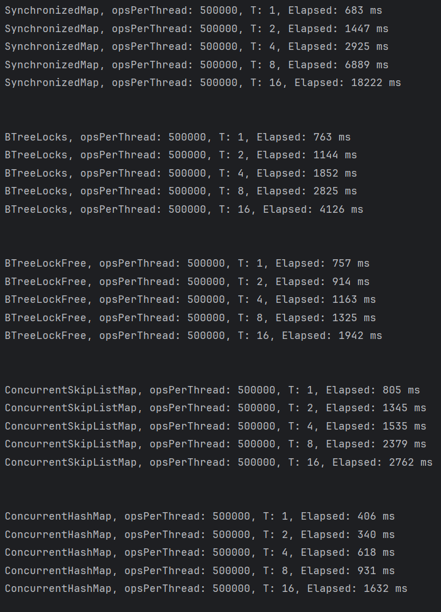

## Task 1
This is the solution to the first task, which involves implementing a thread-safe binary tree.

My two implementations:
- [BTreeLocks](src/main/java/ch/unibe/task1/BTreeLocks.java)
- [BTreeLockFree](src/main/java/ch/unibe/task1/BTreeLockFree.java) (**Best**)

### Using Locks (Fine Grained Synchronization)
The first implementation uses read-write locks. Each node is independently-synchronized component.
During insertion, each thread traverses the tree using the lock associated with the node. The thread holds a read lock 
before entering the node.
If it finds that this node is a leaf node for our key the thread then holds the write lock, performs the node
insertion, and releases the write lock.
If the node is not a leaf node for our value, the thread releases the read lock on the current node and holds the read lock
on the next node. The idea was to avoid congestion in the intermediate nodes and to hold the write lock only when appending 
the new node.

Pseudo code:
```
readLock(current)
├─> Is leaf?
│     ├─ NO  -> readLock(next)  -> readUnlock(current)
│     └─ YES -> upgrade to writeLock(current) -> insert -> writeUnlock(current)
```

I wasn't satisfied with the cumbersomeness of the code and the results of the performance testing that I performed.

### Lock-Free 
I find this approach neater and more efficient. The node uses an AtomicReference for child nodes. So, we can use `CAS` operations alone.
, we can safely and quickly insert new nodes into the tree. For example, if we reach the leaf node, we can perform an insertion.
`newNode`, we simply perform a compareAndSet(null, newNode). If the result is false, then someone was faster than us, 
and we can move on to the next node.

## Performance
Here, we can compare the scalability of the different approaches. Since each thread performs a fixed number of 
imputations, we should ideally achieve a fixed elapsed time, but of course that's not possible in the real world. 
I'm comparing BTreeLockFree and BTreeLocks with SynchronizedMap, which wraps TreeMap, ConcurrentSkipListMap and ConcurrentHashMap.



- **SynchronizeMap** degrades quickly, achieving up to 18 seconds with 16 cores.
- **BTreeLocks** shows better results than just simple Synchronization
- **BTreeLockFree** scales pretty well. I would say it's twice as good as BTreeLocks.
- **ConcurrentSkipListMap** works well, but is worse than my LockFree implementation.
- **ConcurrentHashMap** is better than the LockFree solution, but the second one uses completely different architectures. 
However, I think it's good that my BTreeLockFree is only slightly worse than ConcurrentHashMap.
